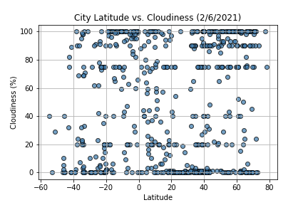

# OpenWeatherMap API

Penn Data Boot Camp Assignment 6 - In the first part of this exercise, I created a Python script to visualize the weather of 500+ cities across the world of varying distance from the equator. Specifically, scatter plots and linear regressions were created to visualize and analyze the correlations between city latitudes and various weather characteristics such as temperature, humidity, and cloudiness. In the second part, I also generated Google heatmaps with selected cities and their corresponding weather characteristics.

Throughout this assignment,  OpenWeatherMap API and Google Places API were used.

## Analysis highlight

1. This scatter plot shows the correlation between Latitudes and the temperatures of a randomly selected sample of more than 500 cities around the world. Glancing over, one can observe a fairly obvious correlation between latitude and temperature. On both sides of 0° Latitude, it appears that as the latitude gets smaller or larger, the temperature gets lower. This makes sense as 0° Latitude is earth's equator. Latitudes < 0° is the Southern Hemisphere, vice version, the Northern Hemisphere. The correlation formed by the dots is very strong and extended for northern hemisphere because the norther it is the colder it is. For the data to the left side of 0° Latitude, the trend does not extend out as much mostly likely because we lack the city temperature data. Even though the data is gathered from a sample of at least 500 cities from the OpenWeatherMap API, it is most definitely because most of the area on the southern hemisphere is covered by ocean, so there are not as many cities when we get closer to the South Pole as to the North Pole, thus not as much data. However, one can reasonably speculate that if there are more cities with even smaller Latitudes, chances are the exact same pattern could show on the left side.

 

2. These two plots show the correlation between Latitude and Humidity/Cloudiness, which looks to be close to 0. Latitude is likely not an influential factor that affects how humid or how cloudy a certain day is at a selected city.

3. This plot shows the correlation between Latitude and Wind Speed, which looks to be close to 0. Latitude is likely not an influential factor that affects how strong the wind is on a given day. Taking a closer look, there might just be a very few potential outlier(s) on the top right (where the wind speed is within the range of 35 to 40 mph). Even though there could be a possibility that higher latitude indicates higher frequency of faster wind, there's not enough evidence to show that trend, at least from the sample we selected.

4. Based on the regression model, for each unit increase (+1) of latitude, the max temperature of a selected city is estiamted to change by -1.4. And when latitude is 0°, meaning at earth's equator, the max temperature of a selected city is estimated to be at 91.96 °F. Also, there is a moderate-strong negative correlation between latitude and temperature in the Northern Hemisphere.

5. Based on the regression model, for each unit increase (+1) of latitude, the max temperature of a selected city is estiamted to change by 0.36. And when latitude is 0°, meaning at earth's equator, the max temperature of a selected city is estimated to be at 81.35 °F. Also, there is a weak-moderate positive correlation between latitude and temperature in the Southern Hemisphere.

6. This is a heatmap of desirable locations for a vacation with humidity as a heat layer and additional hotel information displayed as markers.

#### P.S.
To run the code, please create an "api_keys.py" file, save it in each sub folders ("WeatherPy" and "VacationPy") within this directory, and input your own API keys below.

##### OpenWeatherMap API Key
weather_api_key = "KEY HERE"

##### Google API Key
g_key = "KEY HERE"

